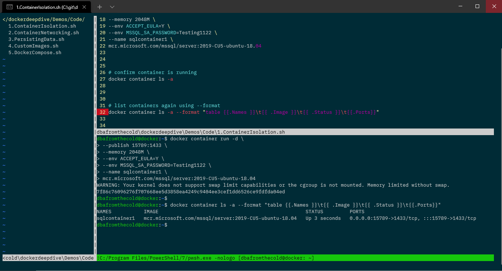
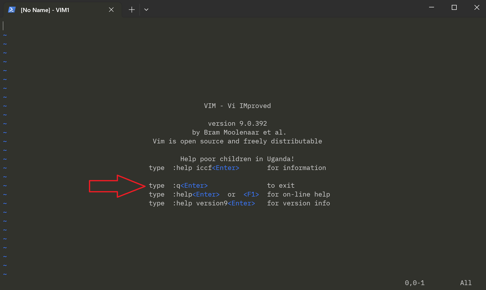
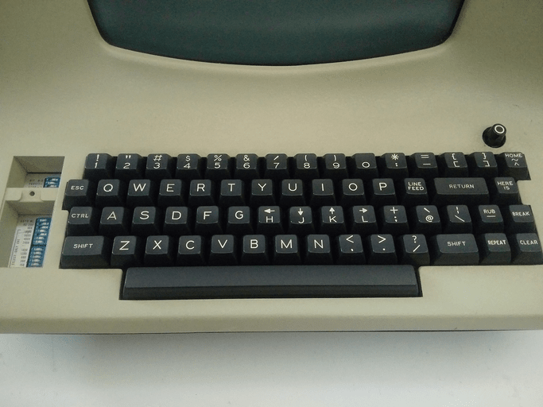
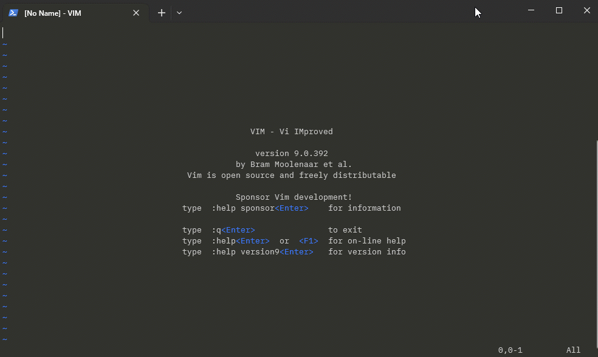
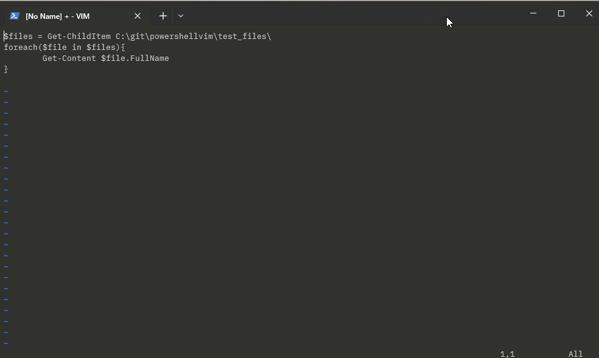
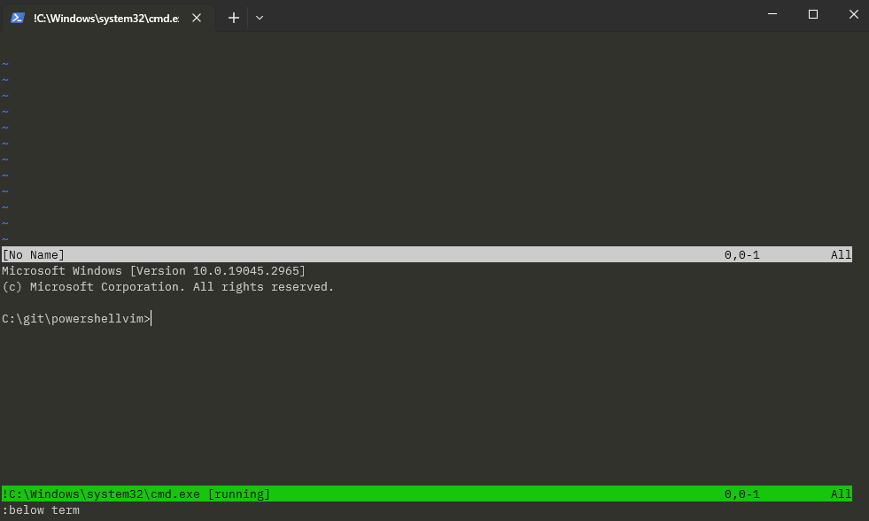

# Running Powershell in Vim

---

## Andrew Pruski

### Field Solutions Architect
### Microsoft Data Platform MVP 

<!-- .slide: style="text-align: left;"> -->
<i class="fab fa-twitter"></i><a href="https://twitter.com/dbafromthecold">  @dbafromthecold</a> 
<i class="fas fa-envelope"></i>  dbafromthecold@gmail.com 
<i class="fab fa-wordpress"></i>  www.dbafromthecold.com 
<i class="fab fa-github"></i><a href="https://github.com/dbafromthecold">  github.com/dbafromthecold</a>

---

## Session Aim
<!-- .slide: style="text-align: left;"> -->
To show what can be done with powershell and Vim

---

## My Vim Setup
<!-- .slide: style="text-align: left;"> -->

  

---

## The Big Question
<!-- .slide: style="text-align: left;"> -->

  

---

## Stop to think
<!-- .slide: style="text-align: left;"> -->

  

---

## History
<!-- .slide: style="text-align: left;"> -->
- Based on its precedessor vi (visual editor)
- Built by Bill Joy in the 1970s
- In 1988, Bram Moolenaar, worked on Vi IMitiation
- Vi IMitation evolved into Vi IMproved
- Released as shareware in 1991
- Continued to evolve in the 1990s and 2000s
- Is now an open-source project

---

## Exiting Vim
<!-- .slide: style="text-align: left;"> -->

---

## Opening Vim
<!-- .slide: style="text-align: left;"> -->

---

## Original Keyboard
<!-- .slide: style="text-align: left;"> -->

  

---

## Modes
<!-- .slide: style="text-align: left;"> -->
- Command
  + Navigation, file operations, searching
- Insert
  + Writing text to a file
- Visual
  + Selecting text in a file

---

## Running a script
<!-- .slide: style="text-align: left;"> -->
- Open up Vim <!-- .element: class="fragment" data-fragment-index="1" -->
- Write the script<!-- .element: class="fragment" data-fragment-index="2" -->
- Save (write) and exit (quit)<!-- .element: class="fragment" data-fragment-index="3" -->
- Navigate to script in powershell<!-- .element: class="fragment" data-fragment-index="4" -->
- Run the script<!-- .element: class="fragment" data-fragment-index="5" -->
- There has to be a better way!<!-- .element: class="fragment" data-fragment-index="6" -->

---

# Demo

---

## Execute Single powershell Command
<!-- .slide: style="text-align: left;"> -->

---

## Execute multi-line command
<!-- .slide: style="text-align: left;"> -->

---

# Demo

---

## Opening a terminal in Vim
<!-- .slide: style="text-align: left;"> -->

---

# Demo

---

## Down the rabbit hole
<!-- .slide: style="text-align: left;"> -->

---

## Configuring Vim with vimrc
<!-- .slide: style="text-align: left;"> -->
- C:\users\USERNAME\vimfiles
- Ability to completely configure everything!
- Set colour scheme
- Set default terminal
- Create shortcuts
- Create abbreviations

---

## NERDTree
<!-- .slide: style="text-align: left;"> -->
- A file tree explorer for Vim
  + Installed as a plugin
  + Or just pull the code down from Github
  + Other repos will add file icons
  + This WILL slow Vim down!

---

# Demo

---

## Resources
<!-- .slide: style="text-align: left;"> -->

<a href="https://github.com/dbafromthecold/powershellvim">https://github.com/dbafromthecold/powershellvim</a> 

