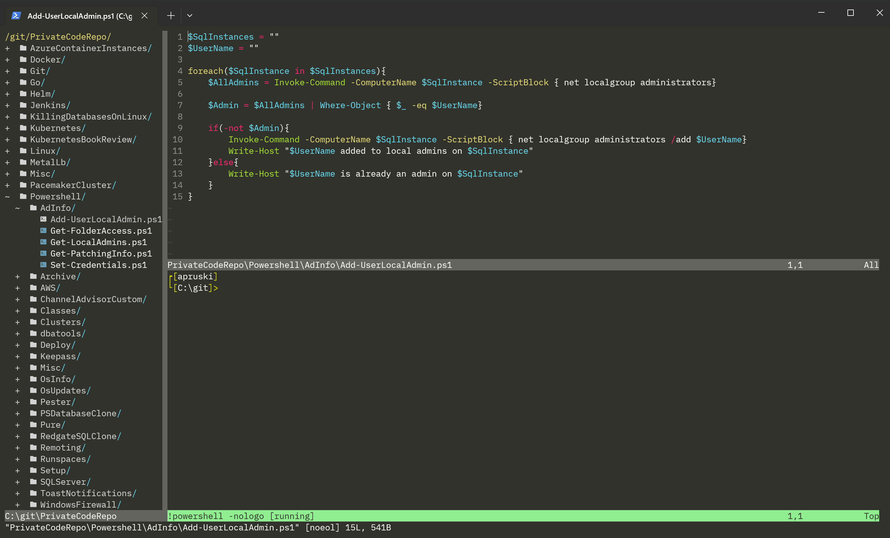

# Running Powershell in Vim

---

## Andrew Pruski

### Field Solutions Architect
### Microsoft Data Platform MVP 

<!-- .slide: style="text-align: left;"> -->
<i class="fab fa-twitter"></i><a href="https://twitter.com/dbafromthecold">  @dbafromthecold</a> 
<i class="fas fa-envelope"></i>  dbafromthecold@gmail.com 
<i class="fab fa-wordpress"></i>  www.dbafromthecold.com 
<i class="fab fa-github"></i><a href="https://github.com/dbafromthecold">  github.com/dbafromthecold</a>

---

## Session Aim
<!-- .slide: style="text-align: left;"> -->
To show what can be done with powershell and vim

---

## My VIM Setup
<!-- .slide: style="text-align: left;"> -->

  

---

## The Big Question
<!-- .slide: style="text-align: left;"> -->

  

---

  

---

## Exiting VIM
<!-- .slide: style="text-align: left;"> -->
TBD

---

# Opening VIM
<!-- .slide: style="text-align: left;"> -->
TBD

---

33

---

<iframe width="1120" height="630" src="https://www.youtube.com/embed/ssNJExTNUco" title="Single powershell commands in Vim" frameborder="0" allow="accelerometer; autoplay; clipboard-write; encrypted-media; gyroscope; picture-in-picture; web-share" allowfullscreen></iframe>

---

<iframe width="1120" height="630" src="https://www.youtube.com/embed/8pGGpJMJs4w" title="Multi-line commands in Vim" frameborder="0" allow="accelerometer; autoplay; clipboard-write; encrypted-media; gyroscope; picture-in-picture; web-share" allowfullscreen></iframe>

---

# Demos

---

## Resources

